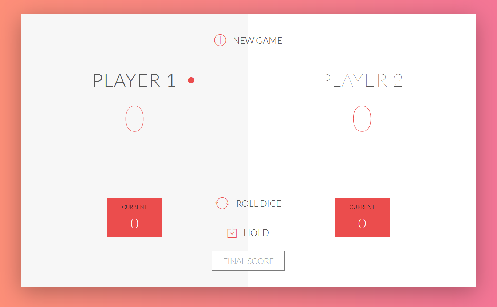

# Pig Game

### Overview

This is an implementation of a dice rolling game called the "pig game"
This code is implemente in HTML/CSS/Javascript
Html context and css style is changed using Javascript DOM manipulation. 

**GAME RULES:**

- The game has 2 players, playing in rounds
- In each turn, a player rolls a dice as many times as they whish. Each result get added to their ROUND score
- BUT, if the player rolls a 1, all his ROUND score gets lost. After that, it's the next player's turn
- The player can choose to 'Hold', which means that their ROUND score gets added to his GLBAL score. After that, it's the next player's turn
- The first player to reach 100 (Default score) points on GLOBAL score wins the game, unless players provides desired final score
  
